# Concesionaria de Vehiculos - SobreRuedas

## Sobre mi
Mi nombre es Julieta Lemos, estudiante de la Tecnicatura en Programación de la UTN. Este es mi examen final de Programación II, con lenguaje Java.
## Resumen
La aplicación permite gestionar distintos tipos de vehículos (**autos, motos y camiones**) con funcionalidades como:
- CRUD completo: Crear, leer, actualizar y eliminar vehículos.
- Filtrado y ordenamiento por atributos (año, precio, tipo).
- Persistencia múltiple, distintos formatos: `.dat`, `.csv`, `.json`, `.txt`.
- Interfaz gráfica en JavaFX para visualizar y manipular la información.

### Capturas de pantalla
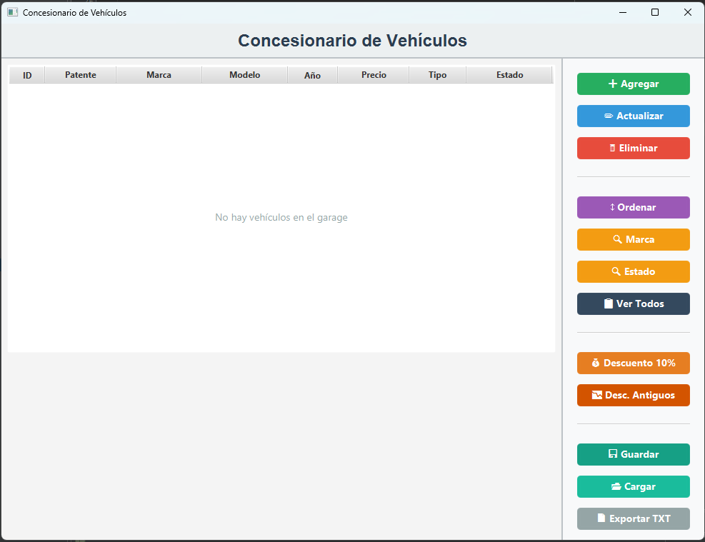
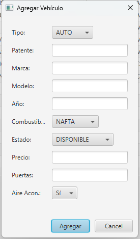
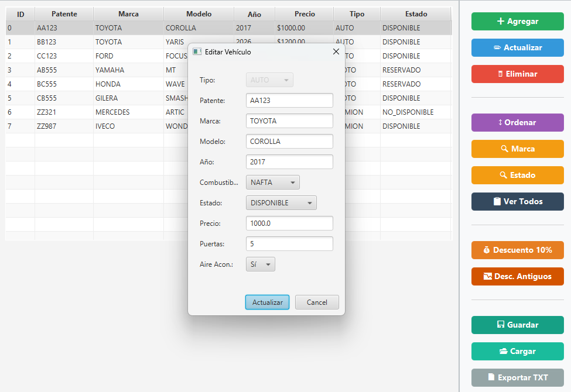
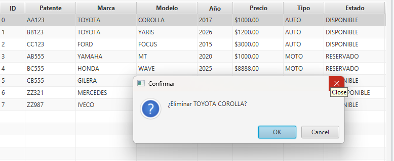
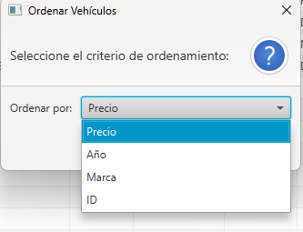
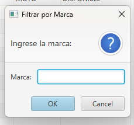
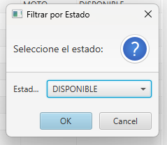
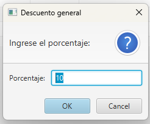
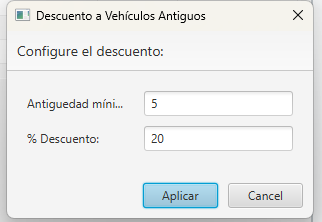

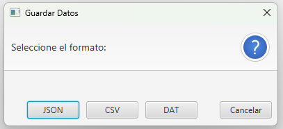

### Diagrama UML
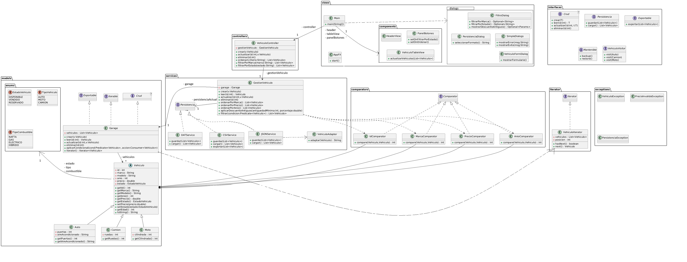

### Como usar la aplicación
Operaciones:
1. Agregar vehículo: Clic en "Agregar" → Completar formulario → "Aceptar"
2. Editar vehículo: Seleccionar vehículo → Clic en "Actualizar" → Editar datos → "Actualizar"
3. Eliminar: Seleccionar vehículo → Clic en "Eliminar" → Confirmar
4. Ordenar: Usar los ComboBox para elegir el tipo de ordenamiento → "Aceptar"
5. Filtrar: Clic en Marca o Estado → Ingresar criterio de filtro → "Aceptar"
6. Guardar: Seleccionar método de guardado (JSON, CSV, DAT) → Nombrar al archivo
7. Cargar: Seleccionar método de carga de archivo → Seleccionar archivo
8. Exportar: Exporta un archivo txt tipo Reporte con todos los vehiculos
